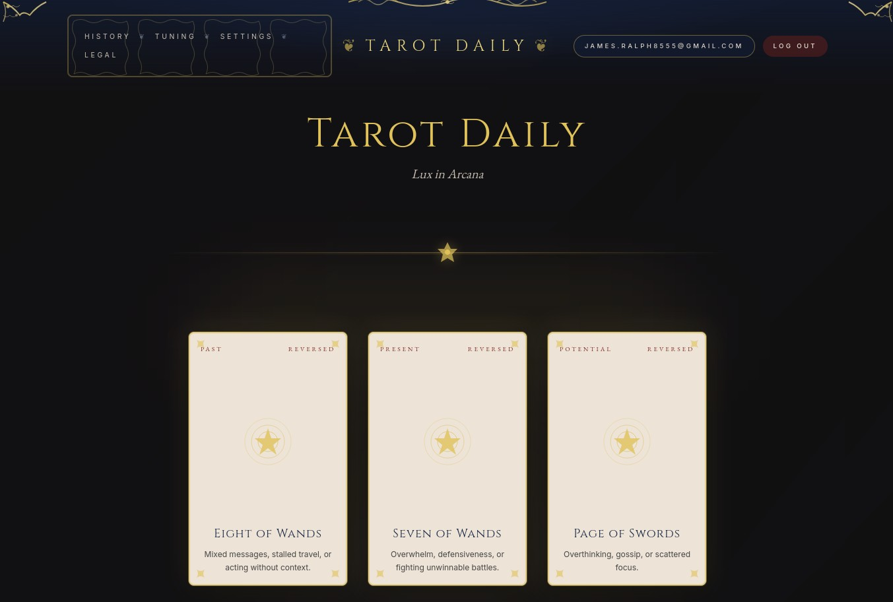

# Daily Tarot

AI powered daily tarot readings with NextJS web app and Python DSPy pipeline.



## Prerequisites

- Docker
- Node.js 22+
- Python 3.13+

## Quick Start

1. **Install dependencies**
```bash
npm install
cd apps/pipeline && pip install -e .
```

2. **Setup environment**
```bash
# Create .env files from templates (check infra/ for templates)
# Populate API keys and database connection strings
```

3. **Start database**
```bash
docker-compose up -d postgres
```

4. **Run development servers**
```bash
# Web app
cd apps/web && npm run dev

# Pipeline CLI
tarot-pipeline dataset build
```

## Project Structure

- `apps/web/` – NextJS app with API routes and auth
- `apps/pipeline/` – DSPy optimization pipeline with Typer CLI

- `infra/` – Database schemas and deployment configs

## Commands

```bash
# Build all workspaces
npm run build

# Lint all workspaces  
npm run lint

# Format all workspaces
npm run format

# Reset database
docker-compose down -v && docker-compose up -d postgres
```

## Roadmap

[X] NextJS Site
[X] DSPy MIPro Prompt Optimization from Feedback
[ ] DSPy GEPA Prompt Optimization w/ MLFlow integration
[ ] Cloudflare migration
[ ] Chat Interface
